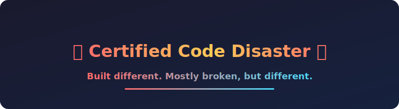

<div align="center">



<br><br>


</div>

---

## 🫦 About This Magnificent Disaster

> **Hot take:** My commit history reads like a true crime documentary. "It worked yesterday" is my villain origin story.

- 🧠 I have the confidence of a senior dev and the skills of a Stack Overflow tab
- ☕ Powered entirely by caffeine, spite, and undeserved optimism
- 🔥 My code compiles on the first try roughly never
- 💅 Yes that's my profile pic. Yes I know. You're welcome.
- 🐛 I ship bugs so exclusive they don't even have names yet
- 💘 Big fan of three things: girls, anime, and Youkie (in no particular order, but it is that order)

---

## 📊 The Numbers Don't Lie (they do)

<div align="center">

</div>

---

## 🎯 What I'm Doing Right Now

```javascript
const me = {
  location: "staring at a bug for 4 hours",
  solution: "it was a missing semicolon",
  emotionalState: "questioning everything",
  coffeeCount: Infinity,
  willFixLater: true, // (lie)
}
```

---

## 💬 Certified Wisdom

> "It's not a bug, it's a surprise feature I didn't ask for."

> "Documentation is just a love letter to your future self that you'll never write."

---

## 🤝 Slide Into My Repos

> **Disclaimer:** I respond to issues with the urgency of a sloth on vacation. Pull requests welcome though — do my job for me, I dare you.

[LinkedIn](https://linkedin.com) · [Twitter](https://twitter.com) · [Email (good luck)](mailto:your@email.com)

---

<div align="center">

### 🎰 Today's Mood


<br><i>me looking productive in standup while actually reading reddit</i>

<br><br>
<b>Thanks for visiting. Now leave before I make you review my code.</b>

</div>
